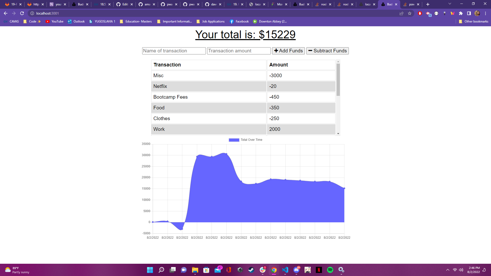

# 19 Progressive Web Applications (PWA): Budget Tracker

This challenge is to add functionality to an existing budget tracker application to allow for offline access and functionality. The user will be able to add expenses and deposits to their budget with or without a connection. When entering transactions offline, they should update the total when brought back online. 


## User Story

```md
AS AN avid traveller
I WANT to be able to track my withdrawals and deposits with or without a data/internet connection
SO THAT my account balance is accurate when I am traveling 
```

## Acceptance Criteria

```md
GIVEN a Budget Tracker without an internet connection
WHEN the user inputs an expense or deposit
THEN they will receive a notification that they have added an expense or deposit
WHEN the user reestablishes an internet connection
THEN the deposits or expenses added while they were offline are added to their transaction history and their totals are updated
```
## Technologies Used
Html
CSS
Javascript
Node

## Screenshots



## Deployed Link
https://young-cliffs-58311.herokuapp.com/


